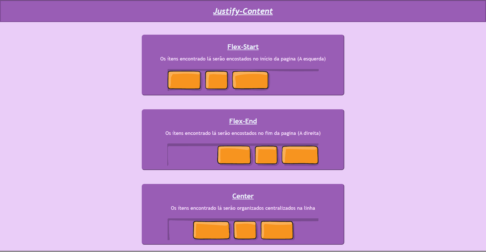

<!--- # "Can be a image or a gift from the project pages" -->

  

# POC 1 - Flexbox

Test of Concept of the main Flexbox properties in CSS. The work was developed by Fernando Lacava, Rafael Trindade and Henrique Totti.

## Tech Stack

## Contribute

1. **Clone project**: `https://github.com/RafaelMaso/POC1-Flexbox.git`
2. **Create feature/branch**: `git checkout -b feature/NAME`

## License

This project is available under the following licenses:

- [MIT](https://rem.mit-license.org)
